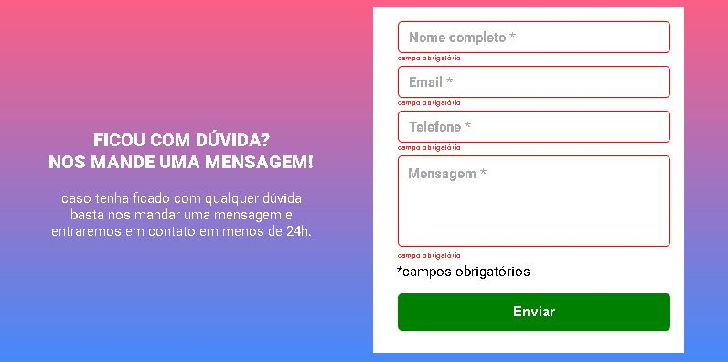

# Formulário Interativo - Quest Dev em Dobro (Nível Intermediário)

<div align="center">
  <a href="[https://github.com/RobertCastro86](https://acordeon-one.vercel.app/)">
    
</div>

Este projeto, desenvolvido durante a quest intermediária de JavaScript do curso Dev em Dobro, tem como objetivo consolidar os conhecimentos em HTML, CSS e JavaScript através da criação de um formulário funcional e esteticamente agradável.

## Funcionalidades
* Coleta de dados de contato (nome, email, telefone).
* Validação de email e número de telefone.
* Envio de dados para um servidor (se aplicável).
* Mensagem de sucesso após o envio do formulário.

## Tecnologias utilizadas
* HTML5
* CSS3
* JavaScript

## Instalação
1. Clone este repositório:
   ```bash
   https://github.com/RobertCastro86/desafio3.git
